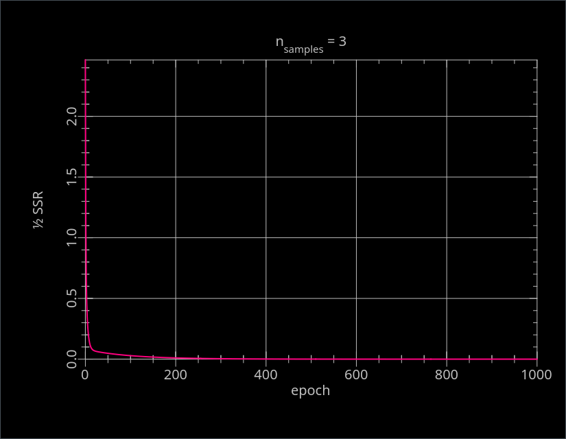

# gdfit

For instructions on building, formatting, testing, etc, see [`README.dev.md`](README.dev.md).

## Executables

- `mkdata` Makes an n-dimensional linear data set with normally distributed noise of a given standard deviation.
- `train` Command line program for iterative fitting of multivariate linear data sets using steepest descent.

## Dependencies

- `libboxmuller`: Normally distributed random number generation
- `libkwargs`: Handling of command line arguments
- `libmatrix`:  Matrix data type and operations on instances of that type

## `man` pages

- `mkdata.1`

## Example

```console
$ cd build
$ ./dist/bin/mkdata --nfeatures 2 \
    --nsamples 100 \
    -s 10 \
    --true_weights 98.7,65.4,32.1 \
    -b data/
$ ./dist/bin/train --nepochs 2500 \
        data/features.txt data/labels.txt
```

## Results

### 1

Make some data: 2 features, 3 samples, no error, sampling locations are within [-1,1] around 0.
```console
$ ./dist/bin/mkdata -v -d 2 -n 3 -l -1,-1 -u 1,1 -s 0 -w 0,1,2 -b data/
nfeatures = 2
nsamples = 3
sigma = 0.000000
basename = "data/"
lower_bounds (1x2):
        -1,         -1
upper_bounds (1x2):
         1,          1
true_weights (1x3):
         0,          1,          2
features (3x2):
 -0.193324,  0.0488842
  0.895684,   0.720692
  0.127965,  -0.262141
labels (3x1):
-0.0955561
   2.33707
 -0.396317
true_residuals (3x1):
        -0
         0
         0
```

Expected: steepest descent should be able to identify the parameters without bias, and the residuals
at the optimal weights should be basically 0. Let's see (1000 epochs, learning rate 0.1):

```console
$ ./dist/bin/train -v -e 1000 -r 0.1 data/features.txt data/labels.txt
# (some output omitted)
+++++++++++++++++++++++++      epoch = 1000  +++++++++++++++++++++++++
weights (1x3):
-2.53532e-06,    1.00003,    1.99997
features_tr1 (3x3):
         1,          1,          1
 -0.193324,   0.895684,   0.127965
 0.0488842,   0.720692,  -0.262141
predicted_tr (1x3):
-0.0955652,    2.33707,  -0.396308
residuals_tr (1x3):
-9.08971e-06,          0, 9.0003e-06
gradients_tr (3x3):
-9.08971e-06,          0, 9.0003e-06
1.75726e-06,          0, 1.15172e-06
-4.44343e-07,          0, -2.35935e-06
step (1x3):
-8.9407e-09, 2.90898e-07, -2.80369e-07
```


Looks ok

### 2

Make data same as in (1), but with some error: 2 features, 3 samples, error 2 sigma, sampling locations are within [-1,1] around 0.

```console
$ ./dist/bin/mkdata -v -d 2 -n 3 -l -1,-1 -u 1,1 -s 2 -w 0,1,2 -b data/
nfeatures = 2
nsamples = 3
sigma = 2.000000
basename = "data/"
lower_bounds (1x2):
        -1,         -1
upper_bounds (1x2):
         1,          1
true_weights (1x3):
         0,          1,          2
features (3x2):
    0.3749,  -0.413378
 -0.419577,  -0.360833
  0.345304,   0.376362
labels (3x1):
   2.48989
  -1.98086
 -0.149706
true_residuals (3x1):
   2.94175
 -0.839612
  -1.24773
```

Expected: steepest descent should be able to identify the parameters, but with bias, and the residuals
at the optimal weights should be basically 0. Let's see (1000 epochs, learning rate 0.1):

```console
$ ./dist/bin/train -v -e 1000 -r 0.1 data/features.txt data/labels.txt
+++++++++++++++++++++++++      epoch = 1000  +++++++++++++++++++++++++
weights (1x3):
 -0.839639,    5.41965,   -3.13925
features_tr1 (3x3):
         1,          1,          1
    0.3749,  -0.419577,   0.345304
 -0.413378,  -0.360833,   0.376362
predicted_tr (1x3):
   2.48989,   -1.98086,  -0.149705
residuals_tr (1x3):
-4.05312e-06, 2.98023e-06, 1.3113e-06
gradients_tr (3x3):
-4.05312e-06, 2.98023e-06, 1.3113e-06
-1.51951e-06, -1.25044e-06, 4.52798e-07
1.67547e-06, -1.07537e-06, 4.93524e-07
step (1x3):
2.38419e-08, -2.31715e-07, 1.09363e-07
```

Looks ok.

### 3

Make data same as in (2), but use more samples: 2 features, 100 samples, error 2 sigma, sampling locations are within [-1,1] around 0.

```console
$ ./dist/bin/mkdata -v -d 2 -n 100 -l -1,-1 -u 1,1 -s 2 -w 0,1,2 -b data/
uh oh nans
```

## Data

See [data/README.md](data/README.md).

## Acknowledgements

_This project was initialized using [Copier](https://pypi.org/project/copier)
and the [Copier template for C projects](https://github.com/jspaaks/copier-template-for-c-projects)._
