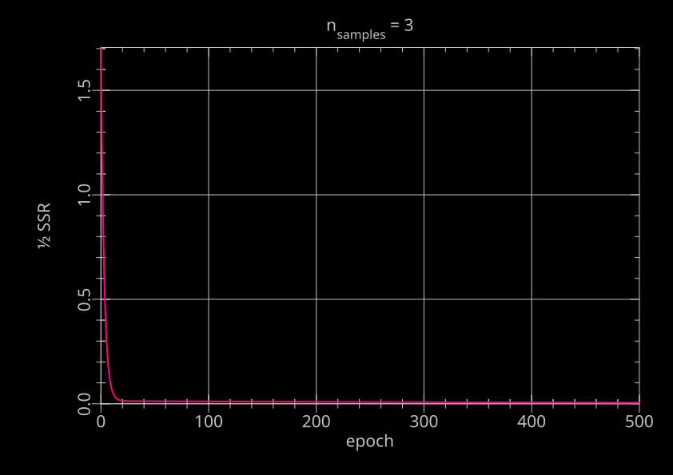
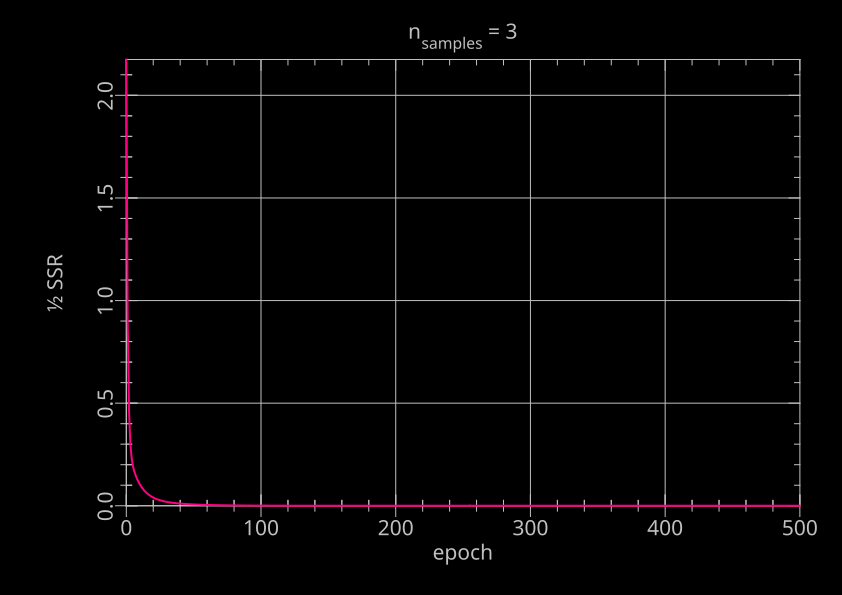
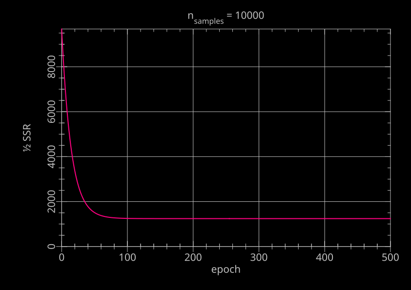
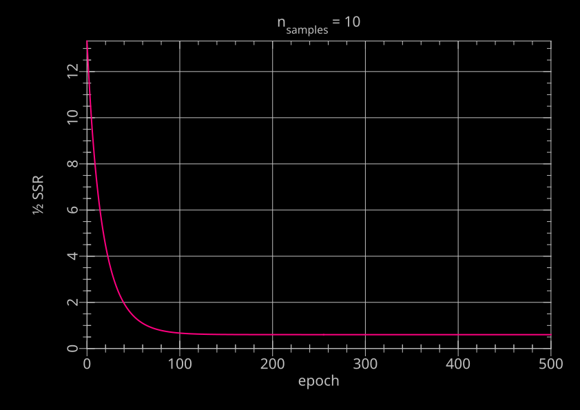

# multivariate linear regression

For instructions on building, formatting, testing, etc, see [`README.dev.md`](README.dev.md).

## Executables

- `mkdata` Makes an n-dimensional linear data set with normally distributed noise of a given standard deviation.
- `train` Command line program for iterative fitting of multivariate linear data sets using batch gradient descent.

## Dependencies

Bundled, see directory `third_party`:

- [`libboxmuller`](https://github.com/jspaaks/libboxmuller): Normally distributed random number generation
- [`libkwargs`](https://github.com/jspaaks/libkwargs): Handling of command line arguments
- [`libmatrix`](https://github.com/jspaaks/libmatrix):  Matrix data type and operations on instances of that type

Assumed installed:

- [Criterion](https://github.com/Snaipe/Criterion): Testing
- PLplot: Interactive plotting or saving figure to file

## `man` pages

- `mkdata.1`
- `train.1`

## Results

```console
$ ./dist/bin/mkdata -h
NAME
       mkdata - Generate multivariate linear artificial data

SYNOPSIS
       mkdata -h
       mkdata --help
       mkdata [OPTION]... [REQUIRED]...

DESCRIPTION
       Required

       -d NFEATURES, --nfeatures NFEATURES
            Number  of  features,  i.e. the dimensionality of the data
            set. Its corresponding value NFEATURES should be  a  posi‐
            tive integer.

       -n NSAMPLES, --nsamples NSAMPLES
            Number  of  samples, i.e. the number of points in d-dimen‐
            sional space that the generated data set will  contain,  d
            being  the  number  of  features.  Its corresponding value
            NSAMPLES should be a positive integer.

       -w TRUE_WEIGHTS, --true_weights TRUE_WEIGHTS
            True weights. The true coefficients  of  the  multivariate
            linear  equation  that  is used to generate the artificial
            data set. The first weight represents the  intercept.  Its
            corresponding  value  TRUE_WEIGHTS should be a comma-sepa‐
            rated, double-quoted  string,  containing  1  +  NFEATURES
            floating point numbers.

       Options

       -b BASENAME, --basename BASENAME
            Basename of the output files. Any directory names in BASE‐
            NAME  should exist before running the command. If this op‐
            tion is omitted, BASENAME is set to  the  string  "artifi‐
            cial-data.".

       -h, --help
            Show the help and exit.

       -l LOWER_BOUNDS, --lower_bounds LOWER_BOUNDS
            Lower bounds of the range of each feature. Its correspond‐
            ing  value  LOWER_BOUNDS should be a comma-separated, dou‐
            ble-quoted string,  containing  NFEATURES  floating  point
            numbers.  If  this  option  is  omitted,  each  element of
            LOWER_BOUNDS is set to 0.0f.

       -s SIGMA, --sigma SIGMA
            Standard deviation of  the  residuals.  Its  corresponding
            value SIGMA should be a floating point number. If this op‐
            tion is omitted, SIGMA is set to 1.0f.

       -u UPPER_BOUNDS, --upper_bounds UPPER_BOUNDS
            Upper bounds of the range of each feature. Its correspond‐
            ing  value  UPPER_BOUNDS should be a comma-separated, dou‐
            ble-quoted string,  containing  NFEATURES  floating  point
            numbers.  If  this  option is omitted, each element of UP‐
            PER_BOUNDS is set to 1.0f.
       -v, --verbose
            Verbose output.

EXAMPLES
       Generate 7 samples in a 3-dimensional space, using the  default
       bounds, standard deviation, and basename:

            $ mkdata --nfeatures 3 --nsamples 7 --true_weights "8.7,2.34,23.0,150"

       Generate 25 samples in  a  2-dimensional  space,  using  custom
       bounds, standard deviation, and basename:

            $ mkdir data && mkdata --nfeatures 2 \
                                   --nsamples 25 \
                                   --true_weights "246.5,78.35,68.0" \
                                   --lower_bounds "-10.0,1000" \
                                   --upper_bounds "10.0,3000" \
                                   --sigma 12.1 \
                                   --basename "data/"
$ ./dist/bin/train -h
NAME
       train - Use batch gradient descent to train a multivariate linear model

SYNOPSIS
       train -h
       train --help
       train [OPTIONAL]... FEATURES_PATH LABELS_PATH

DESCRIPTION
       Use batch gradient descent to train a multivariate linear model.

       Optionals

       -d DEVICE, --device DEVICE
            The output device used for plotting. Use "?" for interactively
            selecting a device, "null" for no output. Defaults to interactive
            device selection, including overview of available device names.

       -e NEPOCHS, --nepochs NEPOCHS
            Number of epochs. An epoch is equivalent to one pass through the
            entire data set.

       -h, --help
            Show the help.

       -r LEARNING_RATE, --learning_rate LEARNING_RATE
            The learning rate of the gradient descent analysis. Simply a
            scaling factor that is applied to the calculated gradient of the
            loss with respect to the weights.

       -v, --verbose
            Verbose output.

       -w INITIAL_WEIGHTS, --initial_weights INITIAL_WEIGHTS
            The point in the parameter space from where to start the iterative
            procedure of updating the weights.

       -z, --standardize
            Whether to standardize the features and labels values before
            training.

       Positionals

       FEATURES_PATH
            The path to the file containing the features used for training.
            Paths can be relative or absolute. The file format should be that
            outputted by sibling program "mkdata".

       LABELS_PATH
            The path to the file containing the labels used for training.
            Paths can be relative or absolute. The file format should be that
            outputted by sibling program "mkdata".

EXAMPLES
       Train a linear model based on the features from "features.txt" and the
       labels from "labels.txt" using default options:

            $ ./train features.txt labels.txt

       Train a linear model based on the features from "data/features.txt" and
       the labels from "data/labels.txt" using 100 epochs, a learning rate of
       0.001, and initialize the weights at (10.2, 34.7, 0.1); afterwards, use
       the interactive "qtwidget" device to make a plot of the loss as a
       function of epoch:

            $ ./train --device qtwidget \
                      --nepochs 100 \
                      --learning_rate 0.001 \
                      --initial_weights 10.2,34.7,0.1 \
                      data/features.txt data/labels.txt
```

### experiment 1

Make some data: 2 features, 3 samples, no error, sampling locations are within [-1,1] around 0.
```console
$ mkdir data1
$ ./dist/bin/mkdata -v -d 2 -n 3 -l -1,-1 -u 1,1 -s 0 -w 0,1,2 -b data1/
nfeatures = 2
nsamples = 3
sigma = 0.000000
basename = "data1/"
lower_bounds (1x2):
        -1,         -1
upper_bounds (1x2):
         1,          1
true_weights (1x3):
         0,          1,          2
features (3x2):
  0.895397,  -0.515717
 0.0227478,   0.883006
  0.772312,  -0.605202
labels (3x1):
 -0.136037
   1.78876
 -0.438091
true_residuals (3x1):
         0
         0
         0
```

Expected: gradient descent should be able to identify the parameters without bias, and the residuals
at the optimal weights should be basically 0. Let's see:

```console
$ ./dist/bin/train -e 500 -r 0.1 data1/features.txt data1/labels.txt
+++++++++++++++++++++++++      epoch = 500   +++++++++++++++++++++++++
weights (1x3):
  0.433691,   0.167148,    1.53371
predicted_tr (1x3):
 -0.207604,    1.79177,  -0.365422
residuals_tr (1x3):
-0.0715673, 0.00300598,  0.0726695
gradients_tr (3x3):
-0.0715673, 0.00300598,  0.0726695
-0.0640812, 6.83795e-05,  0.0561235
 0.0369085,  0.0026543, -0.0439797
step (1x3):
0.000410812, -0.00078893, -0.000441692
```



Not sure if the parameters would be better identified after more epochs, let's try:

```console
$ ./dist/bin/train -d null -e 50000 -r 0.1 data1/features.txt data1/labels.txt
+++++++++++++++++++++++++      epoch = 50000 +++++++++++++++++++++++++
weights (1x3):
2.28185e-05,   0.999957,    1.99998
predicted_tr (1x3):
  -0.13604,    1.78876,  -0.438088
residuals_tr (1x3):
-3.14415e-06, -1.19209e-07, 3.30806e-06
gradients_tr (3x3):
-3.14415e-06, -1.19209e-07, 3.30806e-06
-2.81526e-06, -2.71175e-09, 2.55485e-06
1.62149e-06, -1.05263e-07, -2.00204e-06
step (1x3):
4.47035e-09, -2.63117e-08, -4.85817e-08
```

Seems OK.

### experiment 2

Make data same as in (1), but with some error: 2 features, 3 samples, error 0.5 sigma, sampling locations are within [-1,1] around 0.

```console
$ mkdir data2
$ ./dist/bin/mkdata -v -d 2 -n 3 -l -1,-1 -u 1,1 -s 0.5 -w 0,1,2 -b data2/
nfeatures = 2
nsamples = 3
sigma = 0.500000
basename = "data2/"
lower_bounds (1x2):
        -1,         -1
upper_bounds (1x2):
         1,          1
true_weights (1x3):
         0,          1,          2
features (3x2):
  0.170954, 0.00621355
 -0.190691,   0.585458
  0.986868,   0.851193
labels (3x1):
  0.246451
    0.6678
   1.96014
true_residuals (3x1):
 0.0630704
 -0.312425
 -0.729117
```

Expected: gradient descent should be able to identify the parameters, but with bias, and the residuals
at the optimal weights should be basically 0. Let's see:

```
$ ./dist/bin/train -e 500 -r 0.1 data2/features.txt data2/labels.txt
+++++++++++++++++++++++++      epoch = 500   +++++++++++++++++++++++++
weights (1x3):
  0.098911,   0.818069,    1.23815
predicted_tr (1x3):
  0.246456,   0.667796,    1.96014
residuals_tr (1x3):
5.43892e-06, -4.11272e-06, -4.76837e-07
gradients_tr (3x3):
5.43892e-06, -4.11272e-06, -4.76837e-07
9.29806e-07, 7.84259e-07, -4.70575e-07
3.3795e-08, -2.40782e-06, -4.0588e-07
step (1x3):
8.49366e-08, 1.24349e-07, -2.77991e-07
```



Parameter values after more epochs:

```console
$ ./dist/bin/train -d null -e 50000 -r 0.1 data2/features.txt data2/labels.txt
+++++++++++++++++++++++++      epoch = 50000 +++++++++++++++++++++++++
weights (1x3):
 0.0989072,   0.818064,    1.23816
predicted_tr (1x3):
  0.246452,   0.667799,    1.96014
residuals_tr (1x3):
8.9407e-07, -7.7486e-07, -1.19209e-07
gradients_tr (3x3):
8.9407e-07, -7.7486e-07, -1.19209e-07
1.52845e-07, 1.47759e-07, -1.17644e-07
5.55535e-09, -4.53648e-07, -1.0147e-07
step (1x3):
         0, 1.8296e-08, -5.49563e-08
```

Looks OK.

### experiment 3

Make data same as in (2), but use more samples: 2 features, 10000 samples, error 0.5 sigma, sampling locations are within [-1,1] around 0.

```console
$ mkdir data3
$ ./dist/bin/mkdata -d 2 -n 10000 -l -1,-1 -u 1,1 -s 0.5 -w 0,1,2 -b data3/
```

Expected: gradient descent should be able to identify the parameters without much bias, but the residuals
at the optimal weights should be about 0.5 sigma. Expected halfssr would be 0.5 * 10000 * 0.5^2 = 1250.
Let's see (learning rate much smaller to account for more samples):

```
$ ./dist/bin/train -e 500 -r 0.00001 data3/features.txt data3/labels.txt
+++++++++++++++++++++++++      epoch = 500   +++++++++++++++++++++++++
weights (1x3):
0.00220981,   0.992276,    1.99991
# (rest omitted)
```



Looks OK.

### experiment 4

Make data same as in (3), but use fewer samples: 2 features, 10 samples, error 0.5 sigma, sampling locations are within [-1,1] around 0.

```console
$ mkdir data4
$ ./dist/bin/mkdata -d 2 -n 10 -l -1,-1 -u 1,1 -s 0.5 -w 0,1,2 -b data4/
```

Expected: gradient descent should be able to identify the parameters with some bias, but the residuals
at the optimal weights should be less than 0.5 sigma, because the model is partly fitting the error (overtraining).
Expected halfssr would be less than 0.5 * 10 * 0.5^2 = 1.25. Let's see:

```
$ ./dist/bin/train -e 500 -r 0.01 data4/features.txt data4/labels.txt
+++++++++++++++++++++++++      epoch = 500   +++++++++++++++++++++++++
weights (1x3):
 -0.146037,     1.2511,    2.71154
predicted_tr (1x10):
  0.811816,   -2.37099,   -1.37658,    1.06732,   -2.76226,   0.737364,    1.59596,    1.84294,   -1.14283,  -0.840681
residuals_tr (1x10):
-0.0443147,  -0.188047,   -0.53058,  0.0666643,   0.724479,   0.333184,  0.0744356,  0.0247827,  0.0253967,  -0.486004
gradients_tr (3x10):
-0.0443147,  -0.188047,   -0.53058,  0.0666643,   0.724479,   0.333184,  0.0744356,  0.0247827,  0.0253967,  -0.486004
-0.0293961,  0.0912525,  -0.303208, -0.0658335, -0.0964347,   0.328641, -0.0575022, 0.00804809, -0.0130048,   0.137419
-0.00209081,   0.112197,   0.380687,  0.0602065,  -0.654516,  -0.043086,  0.0743516,  0.0144653, -0.00333573,  0.0610994
step (1x3):
-2.05636e-08, -1.86115e-07, -2.24374e-07
```



Looks OK.

## Data

See [data/README.md](data/README.md).

## Acknowledgements

_This project was initialized using [Copier](https://pypi.org/project/copier)
and the [Copier template for C projects](https://github.com/jspaaks/copier-template-for-c-projects)._
