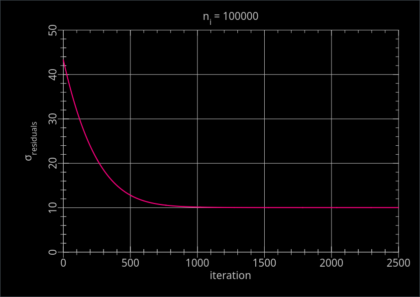
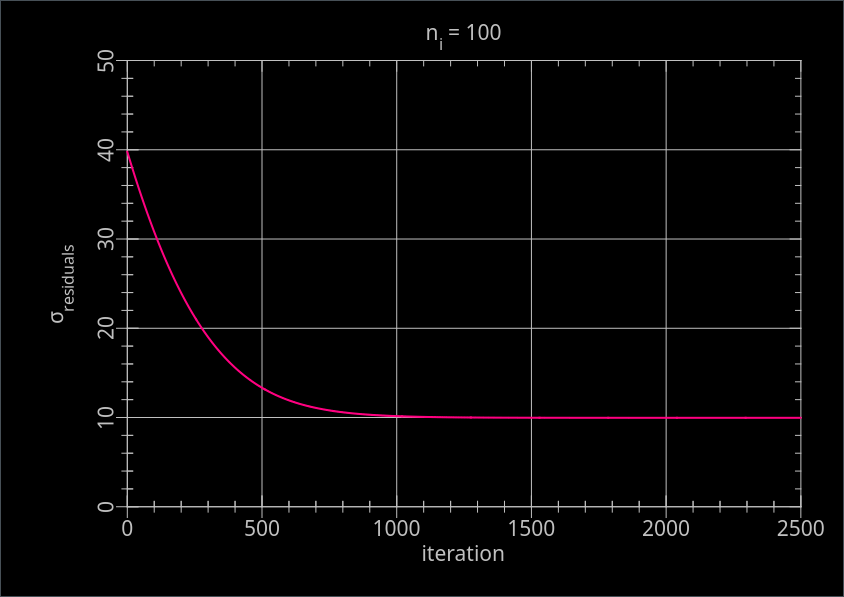

# gdfit

For instructions on building, formatting, testing, etc, see [`README.dev.md`](README.dev.md).

## Executables

- `mkdata` Makes an n-dimensional linear data set with normally distributed noise of a given standard deviation.
- `train` Command line program for iterative fitting of multivariate linear data sets using steepest descent.
- `linear-regression-ssr-bgd-artificial` 2-D linear regression of artificially generated data using batch gradient descent with sum of squared residuals as loss function.

## Libraries

- `kwargs`: Handling of command line arguments.
- `matrix`: Matrix data type and operations on instances of that type.

## `man` pages

- `kwargs.3`
- `matrix.3`
- `mkdata.1`

## Example

```console
$ cd build
$ ./dist/bin/mkdata --nfeatures 2 --nsamples 100 -s 10 --true_weights 98.7,65.4,32.1 -b data/
$ ./dist/bin/train --nepochs 2500 data/features.txt data/labels.txt
```

<!-- TODO add image of result -->

## Data

See [data/README.md](data/README.md).

## Results

```console
$ ./dist/bin/linear-regression-ssr-bgd-artificial
true_weights (1x3):
      98.7,       65.4,       32.1
weights (1x3):
   98.6485,    65.3076,    32.0784
# true_sigma = 10
```



```console
$ ./dist/bin/linear-regression-ssr-bgd-artificial
true_weights (1x3):
      98.7,       65.4,       32.1
weights (1x3):
   98.3823,    63.9584,     28.372
# true_sigma = 10
```



## Acknowledgements

_This project was initialized using [Copier](https://pypi.org/project/copier)
and the [Copier template for C projects](https://github.com/jspaaks/copier-template-for-c-projects)._
